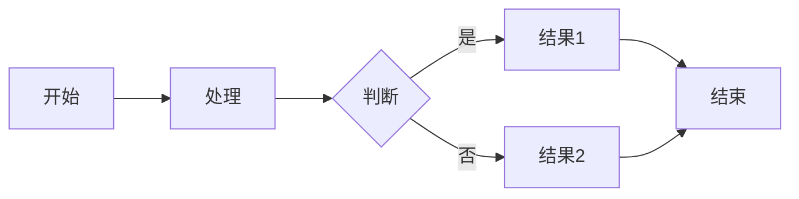

# VuePress 语法参考

## 1. 自定义容器

### 基本语法

```markdown
::: type [title]
内容
:::
```

### 容器类型

#### Tip（提示）

```markdown
::: tip
这是一个提示
:::

::: tip 自定义标题
带有自定义标题的提示
:::
```

**效果**：
- 蓝色背景
- 用于有用的提示信息
- 可以自定义标题

#### Warning（警告）

```markdown
::: warning
这是一个警告
:::
```

**效果**：
- 黄色背景
- 用于需要注意的警告
- 重要但不危险

#### Danger（危险）

```markdown
::: danger
危险操作
:::
```

**效果**：
- 红色背景
- 用于危险操作或重要警告
- 可能导致数据丢失或不可逆操作

#### Info（信息）

```markdown
::: info
补充信息
:::
```

**效果**：
- 灰色背景
- 用于补充说明信息
- 背景信息、补充说明

#### Details（详情）

```markdown
::: details 点击展开详情
可折叠的详细内容
:::
```

**效果**：
- 可折叠的容器
- 默认折叠，点击展开
- 适合放置详细但不重要的信息

### 嵌套容器

```markdown
::: tip 外层提示
外层提示内容

::: warning 内层警告
嵌套的警告内容
:::

继续外层提示内容
:::
```

## 2. 代码块增强

### 代码块选项

```markdown
```cpp {1,3-5}
// 这行会高亮
// 这行不会高亮
// 这行会高亮
// 这行会高亮
// 这行会高亮
// 这行不会高亮
```
```

### 代码块标题

```markdown
```cpp title="example.cpp"
// 代码内容
```
```

### 行号

```markdown
```cpp {showLineNumbers}
// 代码内容
```
```

### 代码组

```markdown
::: code-tabs

@tab Tab 1

```cpp
// C++ 代码
```

@tab Tab 2

```python
# Python 代码
```

:::
```

## 3. 自定义组件

### Badge（徽章）

```markdown
<Badge type="tip">提示</Badge>
<Badge type="warning">警告</Badge>
<Badge type="danger">危险</Badge>
<Badge type="info">信息</Badge>

<Badge text="自定义文本" />
```

### Card（卡片）

```markdown
::: card
卡片内容
:::

::: card{title="卡片标题"}
卡片内容
:::
```

### Tabs（标签页）

```markdown
::: tabs

@tab 标签 1

内容 1

@tab 标签 2

内容 2

:::
```

## 4. 路由和链接

### 内部链接

```markdown
[链接文本](./other-page.md)
[链接文本](../directory/page.md)
[链接文本](#section-id)
```

### 外部链接

```markdown
[链接文本](https://example.com)
[链接文本](https://example.com/page)
```

### 链接属性

```markdown
[链接文字](https://example.com){target="_blank" rel="noopener noreferrer"}
```

### 内部跳转锚点

```markdown
[跳转到示例](#示例)

## 示例

示例内容...
```

## 5. Frontmatter 变量

### 页面变量

```yaml
---
title: 页面标题
description: 页面描述
date: 2024-03-12
tags: [tag1, tag2]
categories: [category]
permalink: /custom-url/
---
```

### 布局变量

```yaml
---
layout: PageLayout # 布局组件
home: true         # 首页标识
---
```

### 其他变量

```yaml
---
author: 作者名
prev: /prev-page/
next: /next-page/
sidebar: auto      # 侧边栏配置
---
```

## 6. 表格增强

### 对齐方式

```markdown
| 左对齐 | 居中 | 右对齐 |
|:-------|:----:|-------:|
| 内容   | 内容 | 内容   |
```

### 表格样式

VuePress 默认使用简洁的表格样式，可以通过 CSS 自定义：

```css
/* 自定义表格样式 */
table {
  border-collapse: collapse;
  width: 100%;
}

th, td {
  border: 1px solid #ddd;
  padding: 8px;
  text-align: left;
}

th {
  background-color: #f5f5f5;
}
```

## 7. 图片增强

### 基本用法

```markdown

```

### 带有链接的图片

```markdown
[](https://example.com)
```

### 图片尺寸

VuePress 支持通过 HTML 标签控制图片尺寸：

```html

```

### 响应式图片

```html

```

## 8. 元素装饰

### 分隔线

```markdown
---
```

### Element Plus 分隔线

```markdown
<el-divider />
<el-divider>分隔文字</el-divider>
<el-divider border-style="dashed">虚线分隔</el-divider>
<el-divider border-style="dotted">点线分隔</el-divider>
<el-divider content-position="left">左对齐</el-divider>
<el-divider content-position="right">右对齐</el-divider>
```

### 标题样式

```html
<h1 style="text-align: center;">居中标题</h1>
<h2 style="color: #409eff;">蓝色标题</h2>
<h3 style="font-size: 1.2rem;">自定义大小标题</h3>
```

## 9. 数学公式

### 行内公式

```markdown
$E = mc^2$
```

### 块级公式

```markdown
$$
\sum_{i=1}^{n} i = \frac{n(n+1)}{2}
$$
```

### 安装支持

需要安装 `markdown-it-mathjax3` 插件：

```bash
npm install -D markdown-it-mathjax3
```

## 10. 流程图

### Mermaid

```markdown

```

### 安装支持

需要安装 `markdown-it-mermaid` 插件：

```bash
npm install -D markdown-it-mermaid
```

## 11. 特殊字符转义

### HTML 实体

```markdown
&copy;  © 版权符号
&reg;   ® 注册商标
&trade; ™ 商标符号
&amp;   & 和符号
&lt;     < 小于号
&gt;     > 大于号
&quot;  " 双引号
&apos;  ' 单引号
```

### Markdown 转义

```markdown
\* 斜体星号
\_ 斜体下划线
\# 井号（不是标题）
\` 反引号（不是代码）
\\ 反斜杠
```

## 12. 注释

```markdown
<!-- 这是 HTML 注释 -->
<!-- 在 VuePress 中会被保留 -->
```

## 13. 代码注入

### 注入脚本

```markdown
<script>
export default {
  mounted() {
    console.log('页面已挂载')
  }
}
</script>
```

### 注入样式

```markdown
<style>
.custom-class {
  color: red;
}
</style>
```

## 14. 插件语法

### 容器插件

```markdown
::: v-pre
{{ 这里不会被 Vue 处理 }}
:::
```

### 代码高亮

```markdown
::: code-group

```cpp [C++]
int x = 0;
```

```python [Python]
x = 0
```

:::
```

## 15. 最佳实践

### 1. 使用语义化的容器

根据内容性质选择合适的容器类型：
- 重要信息用 `danger`
- 注意事项用 `warning`
- 有用提示用 `tip`
- 补充说明用 `info`

### 2. 保持代码块清晰

- 总是指定语言类型
- 为复杂代码添加说明
- 使用行号和行高亮帮助理解

### 3. 优化表格

- 保持表格简洁
- 使用对齐方式提高可读性
- 为表格添加标题

### 4. 合理使用图片

- 使用有意义的文件名
- 添加 alt 文本
- 考虑图片加载性能

### 5. 保持链接可访问

- 使用描述性的链接文本
- 为外部链接添加 `target="_blank"`
- 检查链接是否有效

## 16. 常见问题

### Q: 如何禁用某些 Markdown 解析器功能？

A: 在 `.vuepress/config.js` 中配置：

```js
module.exports = {
  markdown: {
    lineNumbers: false,  // 禁用行号
    linkify: false,      // 禁用自动链接
  }
}
```

### Q: 如何自定义代码主题？

A: 安装并配置主题：

```bash
npm install -D prismjs-theme-night-owl
```

```js
module.exports = {
  markdown: {
    theme: 'night-owl'
  }
}
```

### Q: 如何实现自定义组件？

A: 创建组件文件并在配置中注册：

```js
// .vuepress/components/MyComponent.vue
export default {
  name: 'MyComponent',
  // 组件实现
}

// 使用
<MyComponent />
```
